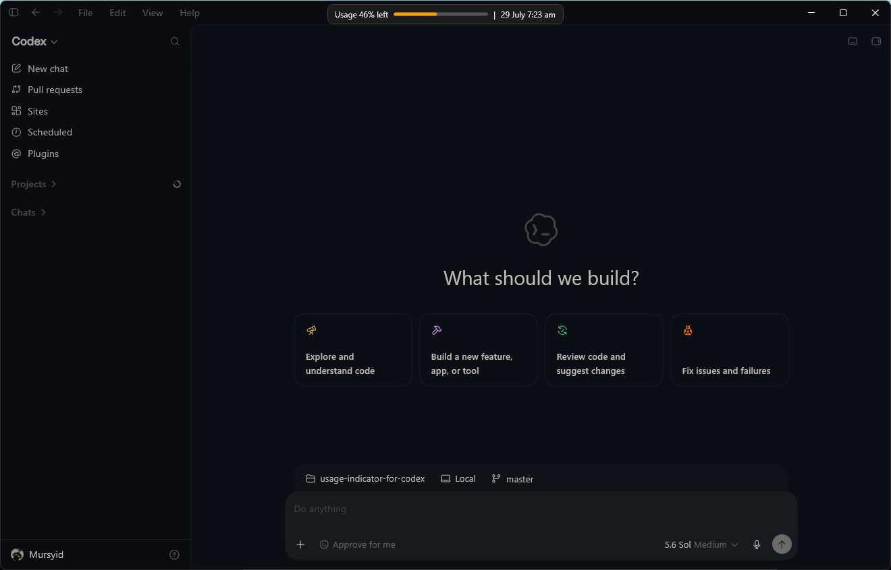
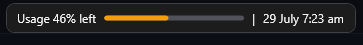

# Usage Indicator for Codex

Usage Indicator for Codex is an independent Windows companion that displays the
most restrictive active Codex usage limit over a Codex Desktop title bar. It
uses the Desktop window only for placement and does not modify the signed Codex
Desktop installation.

Usage comes from the ChatGPT-authenticated account in a separately installed
local Codex CLI. Codex Desktop is not the usage or identity source. If Desktop
and CLI use different accounts, the displayed usage can differ from the account
visible in Desktop.



> The indicator follows Codex Desktop while displaying usage from the separately authenticated local Codex CLI account.

## Requirements

- Windows 11 x64. Windows 10 and Arm64 are not currently verified.
- Codex Desktop for the followed window.
- A compatible Codex CLI authenticated with ChatGPT.
- For development, a .NET SDK capable of targeting `net8.0-windows`.
- For native launcher builds, the x64 MSVC compiler, linker, and library
  manager.
- For installer builds, Inno Setup 6.

The installer and portable ZIP contain a self-contained `win-x64` build. They do
not require a separate .NET runtime and do not install or update .NET, Codex
CLI, or Codex Desktop.

## Recommended installation

The per-user installer is the recommended distribution:

1. Download `UsageIndicatorForCodex-Setup-v0.1.0.exe` and
   `UsageIndicatorForCodex-Setup-v0.1.0.exe.sha256` from the intended GitHub
   Release.
2. Verify the SHA-256 record as described below.
3. Run the installer interactively. It installs only for the current user and
   does not request administrator privileges.
4. Open a new terminal so it receives the updated user `PATH`.
5. Run `usage-indicator start`.

The installer creates:

```text
%LOCALAPPDATA%\Programs\UsageIndicatorForCodex\
├── app\
│   ├── UsageIndicatorForCodex.Gui.exe
│   └── self-contained runtime files
└── bin\
    └── usage-indicator.exe
```

Only the `bin` directory is added to the current user's `PATH`. The installer
records ownership only when it adds that exact entry. Uninstall therefore
preserves a matching PATH entry that existed before installation.

The installer does not enable automatic startup without an explicit command.
Its finish page may offer to start the application normally.

## Unsigned builds and SHA-256

Public builds are currently unsigned. Windows may show Microsoft Defender
SmartScreen or an unknown-publisher warning. Verify the intended repository and
tag before deciding whether to run a build; do not disable system-wide security
protections.

To compare the installer with its published checksum:

```powershell
Get-FileHash .\UsageIndicatorForCodex-Setup-v0.1.0.exe -Algorithm SHA256
Get-Content .\UsageIndicatorForCodex-Setup-v0.1.0.exe.sha256
```

The hexadecimal values must match and the checksum record must name the exact
installer. A checksum detects corruption or substitution relative to that
record, but a checksum downloaded from the same GitHub Release is not an
independent trust channel. If the repository or release were compromised, both
the asset and its checksum could be replaced. The project does not currently
publish an Authenticode signing identity.

## Installed commands

Commands are case-sensitive and accept exactly one verb. Running
`usage-indicator` without arguments shows help.

```text
usage-indicator start             Start the GUI and return immediately
usage-indicator stop              Stop the canonical running instance
usage-indicator status            Print running (exit 0) or stopped (exit 1)
usage-indicator version           Print the product version
usage-indicator check-update      Report whether a stable update is available
usage-indicator update            Verify and launch a newer installer
usage-indicator enable-startup    Register/update current-user logon startup
usage-indicator disable-startup   Remove owned startup tasks
usage-indicator help              Show command help
```

`stop`, `enable-startup`, and `disable-startup` are idempotent. Invalid,
duplicate, combined, or incorrectly cased verbs return exit code 2 and do not
start the companion.

`UsageIndicatorForCodex.Gui.exe` is the WPF application and managed command
host. It is not normally invoked directly.

## Automatic startup

Enable current-user logon startup explicitly:

```powershell
usage-indicator enable-startup
```

This creates or updates the current user's `UsageIndicatorForCodex` Task
Scheduler logon task. The task launches
`UsageIndicatorForCodex.Gui.exe --background`, has no execution-time limit, and
retries a crash up to three times at one-minute intervals.

Disable startup without deleting settings or application files:

```powershell
usage-indicator disable-startup
```

The command removes the canonical task. It removes a legacy task named
`CodexUsageIndicator` only when its action is the recognized
`CodexUsageIndicator.exe --background`; an unrelated same-name task is
preserved.

## Updates

`usage-indicator check-update` queries the latest stable GitHub Release and only
reports availability. It does not download or install anything.

`usage-indicator update` is always explicit:

1. Query the latest stable release.
2. Select the exact versioned installer and its `.sha256` asset.
3. Download both to a version-specific temporary directory.
4. Require the checksum record to name that installer and verify SHA-256.
5. Stop the running companion.
6. Launch the installer visibly and interactively.

The updater never copies over installed application files, supplies no silent
installer flags, and has no timer, service, or automatic background path.
Development builds without an explicitly configured GitHub repository URL fail
closed instead of guessing an owner.

## Portable distribution

The portable ZIP remains a secondary distribution:

1. Download `usage-indicator-for-codex-v0.1.0-win-x64.zip` and
   `usage-indicator-for-codex-v0.1.0-win-x64.zip.sha256`.
2. Verify the exact filename and SHA-256.
3. Extract the complete ZIP to a permanent directory.
4. Launch `UsageIndicatorForCodex.exe`.

The portable native console launcher remains compatible:

```text
UsageIndicatorForCodex.exe                 Start immediately
UsageIndicatorForCodex.exe --background    Start for Task Scheduler
UsageIndicatorForCodex.exe --install       Enable startup, then exit
UsageIndicatorForCodex.exe --uninstall     Disable owned startup, then exit
UsageIndicatorForCodex.exe --toggle        Toggle enabled state
UsageIndicatorForCodex.exe --revalidate-cli
                                           Revalidate the configured CLI safely
UsageIndicatorForCodex.exe --exit          Stop a canonical running instance
UsageIndicatorForCodex.exe --help
UsageIndicatorForCodex.exe -h              Show help
```

Except for no arguments and `--background`, the launcher waits for the WPF
command process so PowerShell receives complete output and the correct exit
code. Portable updates are manual: stop the process, replace the complete
extracted directory, and re-enable startup if its path changed.

## Legacy migration

For a one-time migration from `CodexUsageIndicator`, stop the old process,
install or extract the new release, and launch it. Recognized legacy startup
tasks migrate registration-first and are deleted only after the new task is
registered. Unrecognized same-name tasks are retained.

Settings migrate from:

```text
%LOCALAPPDATA%\CodexUsageIndicator\settings.json
```

to:

```text
%LOCALAPPDATA%\UsageIndicatorForCodex\settings.json
```

Canonical settings always win. When canonical settings are absent and the
legacy file is valid, the application creates the canonical file atomically and
retains the legacy file for rollback. Malformed legacy settings are not
migrated.

## Codex CLI configuration

Without an override, the companion tries:

1. a native `codex.exe` on `PATH`;
2. `%APPDATA%\npm\codex.cmd`;
3. another `codex.cmd` on `PATH`.

To select a trusted installation for the current shell:

```powershell
$env:CODEX_CLI_PATH = 'C:\Program Files\Codex CLI\codex.cmd'
usage-indicator start
```

To configure future interactive and scheduled launches, set the user
environment variable:

```powershell
[Environment]::SetEnvironmentVariable(
    'CODEX_CLI_PATH',
    'C:\Program Files\Codex CLI\codex.cmd',
    'User')
```

Open a new terminal or otherwise ensure the new user environment is visible,
then restart:

```powershell
usage-indicator stop
usage-indicator start
```

Paths containing spaces are supported. An explicit override is authoritative:
relative paths, unsupported extensions, missing files, launch failures,
logged-out CLIs, API-key authentication, incompatible responses, and malformed
responses fail closed to `Usage unavailable`.

Portable users can validate a changed CLI configuration with:

```powershell
.\UsageIndicatorForCodex.exe --revalidate-cli
```

Revalidation reports success or failure only. It does not print identity,
tokens, or usage values and does not compare CLI and Desktop accounts.

## Display and controls



- `Usage —` means the companion is loading or refreshing.
- `Usage unavailable` means no verified current CLI-account response was
  available. It never means 0% remaining. Clicking it retries.
- A percentage appears only after a verified ChatGPT-account response with an
  active reset window.
- The overlay hides when no eligible Codex Desktop window is visible, while its
  window is minimized, or when the title bar is too narrow.
- `Ctrl+Alt+U` and the portable `--toggle` command enable or disable the overlay.

Per-user settings are:

```json
{
  "Enabled": true,
  "HorizontalOffset": 0,
  "VerticalOffset": 6
}
```

Offsets are logical pixels from `-500` through `500`. Missing, malformed, or
invalid canonical settings fall back to defaults.

## Build and test

```powershell
dotnet restore .\UsageIndicatorForCodex.sln
dotnet build .\UsageIndicatorForCodex.sln --configuration Release --no-restore
dotnet run --project .\tests\UsageIndicatorForCodex.Tests\UsageIndicatorForCodex.Tests.csproj --configuration Release --no-build
.\tests\repository-contract.ps1
```

The normal suite uses synthetic data and does not require an authenticated
account. Account-backed probes require deliberate invocation and must not expose
identity or usage values.

## Publish, package, and installer

Release builds require a GitHub repository URL. The build derives it from an
existing `origin` remote or accepts an explicit value. GitHub Actions injects
`${{ github.server_url }}/${{ github.repository }}`. The owner is never guessed.

```powershell
$repositoryUrl = 'https://github.com/OWNER/REPOSITORY'

dotnet restore .\src\UsageIndicatorForCodex\UsageIndicatorForCodex.csproj --runtime win-x64
dotnet publish .\src\UsageIndicatorForCodex\UsageIndicatorForCodex.csproj `
  --configuration Release `
  --runtime win-x64 `
  --self-contained true `
  -p:PublishProfile=win-x64-self-contained `
  -p:RepositoryUrl=$repositoryUrl `
  --output .\artifacts\publish\win-x64

.\scripts\build-launcher.ps1 `
  -Layout Portable `
  -OutputPath .\artifacts\publish\win-x64\UsageIndicatorForCodex.exe

.\scripts\build-launcher.ps1 `
  -Layout Installed `
  -OutputPath .\artifacts\usage-indicator.exe

.\scripts\package-release.ps1 `
  -PublishDirectory .\artifacts\publish\win-x64 `
  -ArchivePath .\artifacts\release\usage-indicator-for-codex-v0.1.0-win-x64.zip

.\scripts\build-installer.ps1 `
  -PublishDirectory .\artifacts\publish\win-x64 `
  -InstalledLauncher .\artifacts\usage-indicator.exe `
  -OutputDirectory .\artifacts\release `
  -RepositoryUrl $repositoryUrl

.\scripts\release-assets.ps1 `
  -InstallerPath .\artifacts\release\UsageIndicatorForCodex-Setup-v0.1.0.exe `
  -PortableArchivePath .\artifacts\release\usage-indicator-for-codex-v0.1.0-win-x64.zip `
  -OutputDirectory .\artifacts\release

.\tests\installer-contract.ps1 `
  -InstallerPath .\artifacts\release\UsageIndicatorForCodex-Setup-v0.1.0.exe
.\tests\release-contract.ps1 -AssetDirectory .\artifacts\release
```

Version `0.1.0` is defined once in `Directory.Build.props`. Release automation
rejects tags other than exact `v0.1.0` and uploads only:

```text
UsageIndicatorForCodex-Setup-v0.1.0.exe
UsageIndicatorForCodex-Setup-v0.1.0.exe.sha256
usage-indicator-for-codex-v0.1.0-win-x64.zip
usage-indicator-for-codex-v0.1.0-win-x64.zip.sha256
```

## Uninstall and complete removal

For an installed copy:

1. Optionally run `usage-indicator disable-startup`; the uninstaller also does
   this.
2. Open **Settings > Apps > Installed apps**, choose **Usage Indicator for
   Codex**, and select **Uninstall**.
3. The uninstaller removes application files and only the PATH entry recorded
   as installer-owned.
4. Optionally delete `%LOCALAPPDATA%\UsageIndicatorForCodex` to remove settings.

For a portable copy:

1. Run `.\UsageIndicatorForCodex.exe --exit`.
2. Run `.\UsageIndicatorForCodex.exe --uninstall`.
3. Delete the extracted directory.

If migrated from the old build, optionally remove
`%LOCALAPPDATA%\CodexUsageIndicator`. These actions do not modify Codex CLI or
Codex Desktop.

## Security and privacy boundaries

The companion launches only the configured CLI as `app-server --stdio`, then
sends `initialize`, `account/read` with `refreshToken: false`, and
`account/rateLimits/read`. It does not read credential files, browser profiles,
tokens, or Codex Desktop package files; alter authentication; send model,
thread, or turn requests; or install/update Codex CLI.

See [SECURITY.md](SECURITY.md) for reporting and the complete trust boundary.

## Limitations

- Desktop and CLI account identities are not automatically correlated.
- Only the configured CLI account's ChatGPT-plan limits are shown; OpenAI
  Platform API usage is not substituted.
- Window detection depends on current Codex Desktop process, package, and title
  conventions.
- Builds are unsigned; SmartScreen and clean-machine installer behavior require
  manual Windows verification.
- A same-release checksum is integrity evidence, not independent publisher
  authentication.
- Windows 10 and Arm64 are not currently claimed.

## Contributing and license

See [CONTRIBUTING.md](CONTRIBUTING.md). This project is licensed under the
[MIT License](LICENSE).
